# Diagramme de Classes - Projet Télécompensation

Ce diagramme représente l'architecture orientée objet du système de télécompensation Laravel/Livewire pour le traitement des fichiers SIBTEL et génération XML ISO 20022.

## Vue d'ensemble

Le système est organisé autour des couches suivantes :
- **Modèles** : Représentation des données de base de données
- **Interfaces** : Contrats pour les services interchangeables
- **Services** : Logique métier et traitement des données
- **Composants Livewire** : Interface utilisateur réactive
- **Fournisseurs** : Configuration et injection de dépendances

## Relations principales

### Modèles Eloquent
- `TcFichier` est le modèle central avec de nombreuses relations
- Relations hiérarchiques : Fichier → Enregistrements → Rejets
- Authentification : User lié aux fichiers via uploader/valideur

### Architecture en couches
- **Services** utilisent des **Interfaces** pour l'injection de dépendances
- **Composants Livewire** utilisent les **Services** pour la logique métier
- **Services** manipulent les **Modèles** pour la persistance

### Interfaces et implémentations
- `ParserInterface` : Parsage des fichiers SIBTEL (implémenté par `EnvParserService`)
- `ValidatorInterface` : Validation des données (implémenté par `ValidatorService`)
- `TransformerInterface` : Génération XML ISO 20022 (implémenté par `XmlTransformerService`)

## Diagramme Mermaid

```mermaid
classDiagram
    %% Models
    class User {
        +String name
        +String email
        +String password
        +String role
        +isAdmin() bool
        +isOperateur() bool
        +isSuperviseur() bool
    }

    class TcFichier {
        +String nom_fichier
        +String chemin_complet
        +String type_valeur
        +String statut
        +int nb_transactions
        +int nb_rejets
        +decimal montant_total
        +datetime date_reception
        +enregistrementsDetails()
        +enregistrementsGlobaux()
        +rejets()
        +xmlProduit()
        +uploader()
        +valideur()
        +commentaires()
        +notifications()
    }

    class TcEnrDetail {
        +int fichier_id
        +String data
    }

    class TcEnrGlobal {
        +int fichier_id
        +String data
    }

    class TcRejet {
        +int fichier_id
        +int detail_id
        +String code_rejet
        +String motif_rejet
        +String etape_detection
        +bool traite
        +fichier()
        +detail()
    }

    class TcPacs004 {
        +int fichier_id
        +int rejet_id
        +String msg_id
        +String contenu_xml
        +bool valide_xsd
        +String statut
        +fichier()
    }

    class TcXmlProduit {
        +int fichier_id
        +String contenu_xml
        +fichier()
    }

    class TcCommentaire {
        +int fichier_id
        +String commentaire
        +fichier()
    }

    class TcNotification {
        +int fichier_id
        +String message
        +fichier()
    }

    class AuditTrail {
        +int user_id
        +String action
        +String details
    }

    class LoginHistory {
        +int user_id
        +datetime login_at
    }

    %% Interfaces
    class ParserInterface {
        <<interface>>
        +parse(cheminFichier) array
        +supporte(cheminFichier) bool
    }

    class ValidatorInterface {
        <<interface>>
        +valider(donnees) bool
        +getErreurs() array
    }

    class TransformerInterface {
        <<interface>>
        +transformer(donnees) String
    }

    class LoggerInterface {
        <<interface>>
        +log(message, level)
    }

    %% Services
    class FichierTraitementService {
        -ParserInterface parser
        -ValidatorInterface validator
        -TransformerInterface transformer
        -LogService logService
        +traiter(fichier)
        +valider(fichier)
        +genererXml(fichier)
    }

    class EnvParserService {
        +parse(cheminFichier) array
        +supporte(cheminFichier) bool
    }

    class ValidatorService {
        -RibValidatorService ribValidator
        +valider(donnees) bool
        +getErreurs() array
    }

    class XmlTransformerService {
        +transformer(donnees) String
    }

    class Pacs004TransformerService {
        +genererPacs004(rejet) String
        +validerXsd(xml) bool
    }

    class ValidationService {
        -AuditService audit
        +validerFichier(fichier)
        +rejeterFichier(fichier, motif)
    }

    class RibValidatorService {
        +valider(rib) bool
        +calculerCle(rib) int
    }

    class AuditService {
        +logAction(user, action, details)
    }

    class ExportService {
        +genererPdf(donnees) String
        +genererExcel(donnees) String
    }

    class LogService {
        +log(message, level)
    }

    class RejetEstimationService {
        +estimerRejets(donnees) array
    }

    %% Livewire Components
    class Upload {
        -FichierTraitementService traitementService
        -AuditService auditService
        +$fichier
        +$typeValeur
        +upload()
        +traiter()
    }

    class Pacs004Generator {
        -Pacs004TransformerService pacs004Service
        -AuditService auditService
        +genererPacs004(fichierId)
        +telechargerXml(pacs004Id)
    }

    class Dashboard {
        +render()
    }

    class RapportExport {
        -ExportService exportService
        +genererRapport()
    }

    %% Providers
    class AppServiceProvider {
        +register()
        +boot()
    }

    %% Relationships
    User <|-- TcFichier : uploaded_by
    User <|-- TcFichier : valide_par
    TcFichier *-- TcEnrDetail : hasMany
    TcFichier *-- TcEnrGlobal : hasMany
    TcFichier *-- TcRejet : hasMany
    TcFichier *-- TcCommentaire : hasMany
    TcFichier *-- TcNotification : hasMany
    TcFichier o-- TcXmlProduit : hasOne
    TcRejet --> TcEnrDetail : belongsTo
    TcPacs004 --> TcFichier : belongsTo

    ParserInterface <|.. EnvParserService : implements
    ValidatorInterface <|.. ValidatorService : implements
    TransformerInterface <|.. XmlTransformerService : implements

    FichierTraitementService ..> ParserInterface : uses
    FichierTraitementService ..> ValidatorInterface : uses
    FichierTraitementService ..> TransformerInterface : uses
    FichierTraitementService ..> LogService : uses
    ValidatorService ..> RibValidatorService : uses
    ValidationService ..> AuditService : uses

    Upload ..> FichierTraitementService : uses
    Upload ..> AuditService : uses
    Pacs004Generator ..> Pacs004TransformerService : uses
    Pacs004Generator ..> AuditService : uses
    RapportExport ..> ExportService : uses
```

## Légende des relations

- `<|--` : Héritage/Inheritance
- `*--` : Composition (hasMany)
- `o--` : Agrégation (hasOne)
- `-->` : Association (belongsTo)
- `..>` : Dépendance (uses)
- `<|..` : Réalisation (implements)

## Couches architecturales

1. **Présentation** : Composants Livewire
2. **Application** : Services métier
3. **Domaine** : Interfaces et logique métier
4. **Infrastructure** : Modèles Eloquent, services externes